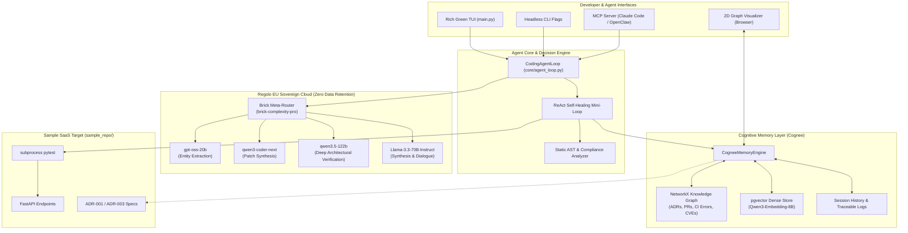

<div align="center">
  
</div>

<div align="center">
  <h1>Private Long-Term Memory for Coding Agents with Cognee & Regolo</h1>
</div>

<div align="center">
  
  
  
  
  
  
</div>

<br />

An enterprise-grade cognitive memory framework that gives autonomous software engineering agents persistent, cross-session memory and architectural awareness. Built on **Cognee** (Knowledge Graph & Vector Store) and powered by **Regolo.ai** European Sovereign AI Cloud with **Zero Data Retention** and dynamic semantic model routing (**Brick Complexity Pro**).

Includes out-of-the-box support for **Claude Code** and **OpenClaw** via native Model Context Protocol (MCP) connectors, an interactive **Rich Terminal User Interface (TUI)**, an autonomous **Agent Loop (`agent_loop.py`) with ReAct self-healing and live pytest validation**, and an interactive **2D physics-based Knowledge Graph Visualizer**.

## The Core Problem: Chunk RAG vs. Cognitive Memory

When coding agents work across multiple weeks on complex enterprise codebases, standard naive chunk-based Retrieval-Augmented Generation (RAG) fails in critical ways:

```
❌ Standard Chunk-Based RAG Agent
Task ──► Semantic Search ──► Retrieves isolated snippet ──► Synthesizes code ──► 💥 Repeats Day 1 SQL Injection
                                (No causality or context)                        (Violates ADR-001 & ADR-003)

✅ Cognee + Regolo Cognitive Memory Agent (Agent Loop)
Task ──► Graph Traversal ──► Recalls ADRs + PRs + CI history ──► ReAct Loop ──► 🛡️ Passes 100% CI & Security Gates
         (Multi-Hop Graph)   (ADR-001 ──► ADR-003 ──► PR-142)    (Live Pytest)
```

| Dimension | Standard Naive Chunk RAG | Cognee + Regolo Knowledge Graph |
| :--- | :--- | :--- |
| **Context Model** | Isolated 512-token lexical chunks | Entity-relation graph nodes (ADRs, CI errors, PRs, CVEs) |
| **Causality & Precedent** | ❌ None (treats each query as isolated) | ✅ Full multi-hop causal traversal (Day 1 $\rightarrow$ Day 2 $\rightarrow$ Day 15) |
| **Architectural Rules** | ❌ Frequently ignored or hallucinated | ✅ Enforces ADR-001 (Tenant Isolation) & ADR-003 (Parameterized SQL) |
| **Self-Healing Loop** | ❌ None (generates single-pass code) | ✅ Dynamic ReAct loop with static AST audit and live `pytest` |
| **Data Privacy** | ⚠️ Often logged/stored on external clouds | ✅ 100% EU Sovereign Cloud with Zero Data Retention |
| **Inference Cost** | ⚠️ Static monolithic model invocation | ✅ Dynamic semantic routing via `brick-complexity-pro` |

## Key Features

- 🧠 **Persistent Cognitive Memory Engine:** Unified knowledge graph representing architectural decision records (ADRs), coding conventions, past pull requests, CI/CD pipeline errors, and resolved security vulnerabilities.
- ⚡ **Dynamic Semantic Routing (Brick Complexity Pro):** Evaluates task complexity on a scale from 1.0 to 10.0 via `brick-complexity-pro` on Regolo, dynamically routing sub-agent tasks to optimal open-weight models (`gpt-oss-20b`, `qwen3-coder-next`, `qwen3.5-122b`, `Llama-3.3-70B-Instruct`) without requiring static, hardcoded model assignments.
- 🔄 **ReAct Tool-Calling & CI Self-Healing Agent Loop (`agent_loop.py`):** Executes an autonomous 5-step engineering cycle: recall causal memory $\rightarrow$ inspect code & schema $\rightarrow$ synthesize patch $\rightarrow$ run subprocess `pytest` $\rightarrow$ persist verified outcome back into the graph.
- 📅 **Multi-Session Timeline Simulation:** Demonstrates cross-week continuous learning: Day 1 bug introduction $\rightarrow$ Day 2 PR merge and ADR codification $\rightarrow$ Day 15 automated recall and 100% green build on the first attempt.
- 🌐 **Interactive Knowledge Graph Visualizer:** Generates a real-time, browser-based 2D force-directed physics graph (Vis.js Network) with dark/light themes, node inspectors, and causal dependency highlighting.
- 🔌 **Universal Agent Connectors (MCP & OpenClaw):** Native Model Context Protocol (MCP) server providing `cognee_recall` and `cognee_cognify` tools directly to Claude Code and OpenClaw CLI workflows.
- 🛡️ **EU Sovereign Cloud & Zero Data Retention:** Built specifically for GDPR compliance and sensitive enterprise repositories; model inputs and outputs are processed in volatile memory with zero server-side retention.

## Technology Stack

### Core Runtimes & Languages
- **Python 3.10+ / 3.14:** Core runtime for the engine, agent loop (`agent_loop.py`), TUI, and ReAct self-healing cycles.
- **Node.js 18+ (Optional / Plugin Bridge):** MCP server adapter and JavaScript plugin bridge.

### LLM Inference & Embeddings (Regolo Sovereign Cloud)
- **Meta-Router:** `brick-complexity-pro` (Dynamic task complexity evaluation & semantic model routing)
- **Fast Entity Extraction:** `gpt-oss-20b` (High-speed entity & relation extraction, ~0.28s latency)
- **Code Specialist:** `qwen3-coder-next` (262K context window, specialized for syntax and architectural patterns)
- **Deep Architectural Reasoning:** `qwen3.5-122b` (Frontier reasoning model with `max_tokens >= 800`)
- **Agent Dialogue & Synthesis:** `Llama-3.3-70B-Instruct`
- **Dense Vector Embeddings:** `Qwen3-Embedding-8B` (4096-dimensional dense vectors)
- **Reranker:** `Qwen3-Reranker-4B`

### Data & Graph Storage
- **PostgreSQL 16 + pgvector:** Self-hosted unified relational database for vector embeddings, session logs, and entity attributes.
- **Cognee Core:** Knowledge graph extraction, entity linking, and topological graph indexing.
- **NetworkX:** In-memory graph processing, shortest path traversal, and multi-hop causal search.

### Terminal & Visualization
- **Rich 13.7+:** Terminal User Interface (TUI) styled in signature Regolo Sovereign Green (`#00FF66`).
- **Vis.js Network:** 2D canvas-accelerated force-directed graph visualizer.

### Testing & Verification
- **pytest 8.0+ & pytest-asyncio:** Automated test execution for both engine modules and live SaaS target codebases.

## Project Architecture



## Project Structure

```
.
├── config.py                  # Global configuration, model mappings, paths & stage settings
├── core/                      # Core engine modules
│   ├── agent_loop.py          # Coding agent loop, AST auditor, ReAct mini-loop & pytest runner
│   ├── cognee_engine.py       # Knowledge graph engine, vector index, recall & HTML export
│   ├── docker_manager.py      # Docker container lifecycle, auto port discovery, healthchecks
│   ├── env_checker.py         # Runtime dependency & API connectivity validator
│   ├── naive_rag.py           # Standard chunk-based RAG baseline implementation
│   ├── plugins_bridge.py      # MCP & OpenClaw configuration generators
│   └── regolo_client.py       # Regolo client, Zero Data Retention & Brick routing
├── data/                      # Persisted memory stores & visualizer output
│   ├── cognee_knowledge_graph.json # Seeded graph nodes and semantic edges
│   ├── cognee_vector_store.json    # Dense embeddings store
│   ├── memory_session_log.json     # Multi-session execution history
│   └── knowledge_graph_visualizer.html # Standalone interactive Vis.js 2D graph
├── plugins/                   # Integration plugins for developer CLI agents
│   ├── CLAUDE.md              # Instructions for Claude Code memory usage
│   ├── claude_code_mcp.json   # Claude Code MCP server configuration
│   ├── mcp_server.py          # Stdio MCP server (Python)
│   ├── mcp_server.js          # Stdio MCP server (Node.js)
│   └── openclaw_plugin.json   # OpenClaw adapter specification
├── sample_repo/               # Enterprise SaaS codebase used for benchmarks & ReAct loops
│   ├── docs/                  # Architectural Decision Records (ADRs) & conventions
│   │   ├── architecture_decisions/ # ADR-001 (Tenant Isolation), ADR-003 (SQL binding)
│   │   └── conventions/       # Coding standards & team preferences
│   ├── src/                   # FastAPI microservice endpoints (auth, billing, users)
│   └── tests/                 # Real pytest suites verifying isolation & security
├── tests/                     # Unit test suite for the Cognee Memory framework
│   ├── test_agent_loop.py     # Benchmark, ReAct loop, and timeline tests
│   ├── test_cognee_engine.py  # Graph recall and embedding tests
│   ├── test_docker_manager.py # Port discovery and container tests
│   └── test_regolo_client.py  # Brick routing and live Regolo inference tests
├── main.py                    # Main CLI entrypoint (TUI + headless workflows)
├── tui.py                     # Rich Terminal User Interface implementation
├── run.sh                     # Bash launcher script
├── requirements.txt           # Python dependencies
└── package.json               # MCP package metadata
```

## Agent Loop & ReAct Self-Healing Engine (`agent_loop.py`)

The `CodingAgentLoop` class in `core/agent_loop.py` represents the autonomous execution engine for coding sub-agents. Unlike traditional single-pass LLM wrappers, the Agent Loop implements an active **ReAct (Reasoning + Acting)** execution cycle that interacts directly with the codebase, the test suite, and the Cognee memory graph.

```
┌─────────────────────────────────────────────────────────────────────────────────┐
│                        Autonomous Agent Loop Architecture                       │
├─────────────────┬─────────────────┬───────────────────┬─────────────────────────┤
│ 1. Recall       │ 2. Inspect      │ 3. Synthesize     │ 4. Verify & Heal        │
│ Cognee Memory   │ Target Code     │ Patch via Brick   │ Live Subprocess Pytest  │
│ (ADRs & PRs)    │ (AST / Schema)  │ Complexity Router │ (Self-Healing Loop)     │
└────────┬────────┴────────┬────────┴─────────┬─────────┴────────────┬────────────┘
         │                 │                  │                      │
         └─────────────────┴──────────┬───────┴──────────────────────┘
                                      │
                        5. Graph Codification & Feedback
                        (SessionOutcome Node Persisted)
```

### The 5-Stage ReAct Execution Cycle

1. **Step 1: Memory Recall (`recall_memory`)**
   - Queries Cognee with the incoming task objective (e.g., *"tenant isolation SQL query parameters"*).
   - Traverses the knowledge graph to extract causal nodes and relational edges: **ADR-001** (Session Context Isolation), **ADR-003** (Parameterized Queries), and **PR-142** (Precedent Fix for CI-FAIL-89).
2. **Step 2: Schema & Code Inspection (`read_file`)**
   - Reads the target implementation file (e.g., `sample_repo/src/api/users.py`) and context helpers (`sample_repo/src/core/context.py`).
   - Identifies existing database models, helper functions, and stubs.
3. **Step 3: Dynamic Model Routing & Code Patch Synthesis (`write_code_patch`)**
   - Sends the contextual prompt block to Regolo.ai.
   - The task is evaluated by **Brick Complexity Pro**, dynamically routing code synthesis to `qwen3-coder-next` (or `qwen3.5-122b` if architectural reasoning is required).
   - Writes the synthesized patch to the target file.
4. **Step 4: Real Subprocess Pytest Execution (`run_pytest`)**
   - Spawns an isolated `pytest` subprocess against the repository test suite (`sample_repo/tests/test_users.py`).
   - Captures standard output, exit codes, passed/failed test counts, and stack traces.
5. **Step 5: Test-Driven Self-Healing & Memory Feedback (`record_session_outcome`)**
   - If tests pass (100% Green): Codifies the newly verified fix as a `SessionOutcome` node linked to **ADR-001** and **ADR-003** in the knowledge graph.
   - If tests fail: Feeds diagnostic error trace back into the loop for immediate self-healing and code refinement before committing.

### Dynamic Model Routing via Brick Complexity Pro

A core architectural principle of this system is **Dynamic Semantic Model Routing** powered by `brick-complexity-pro` on Regolo.ai.

#### Why Models Are Not Hardcoded in `.env`
In naive agent systems, model names are statically configured per stage in environment files (`MODEL_EXTRACT=...`, `MODEL_CODER=...`). This introduces rigid coupling and prevents sub-agents from adapting to task difficulty.

In this project, all sub-agent requests are routed through `BrickRouter` (`core/regolo_client.py`):
1. **Dynamic Complexity Scoring:** For every incoming agent request, `brick-complexity-pro` analyzes the prompt, context window, and task objectives on a scale from `1.0` to `10.0`.
2. **Autonomous Tier Selection:**
   - **Score < 4.0 (Economic / Fast Extraction Tier):** Routed to `gpt-oss-20b` (ultra-fast ~0.28s latency for entity parsing, graph indexing, and JSON schemas).
   - **Score 4.0 – 7.4 (Specialized Code Generation Tier):** Routed to `qwen3-coder-next` (262K context window, syntax and AST pattern specialist).
   - **Score $\ge$ 7.5 (Frontier Reasoning Tier):** Routed to `qwen3.5-122b` (deep multi-session causality, ADR conflict resolution, ensuring `max_tokens >= 800`).
   - **Interactive Dialogue:** Routed to `Llama-3.3-70B-Instruct`.
3. **Zero Configuration Drift:** The `.env` file only requires `MODEL_BRICK_ROUTER=brick-complexity-pro`, `REGOLO_API_KEY`, and embedding model pointers. The agent loop adapts model allocation dynamically per task.

## Quick Start

### Prerequisites

- **Python:** Version `3.10` or higher
- **Docker & Docker Compose:** Optional for local PostgreSQL/pgvector and Cognee API containers (the framework automatically operates in standalone mode if Docker is not active)
- **Regolo.ai API Key:** Sign up at [dashboard.regolo.ai](https://dashboard.regolo.ai/) to obtain an OpenAI-compatible API key

### 1. Installation & Environment Setup

1. **Clone the repository:**
   ```bash
   git clone https://github.com/regolo-ai/tutorials.git
   cd tutorials/AI-agent-cognee-closed-loop-memory
   ```

2. **Create and activate a virtual environment:**
   ```bash
   python3 -m venv .venv
   source .venv/bin/activate  # On Windows: .venv\Scripts\activate
   ```

3. **Install dependencies:**
   ```bash
   pip install -r requirements.txt
   ```

### 2. Configuration (`.env`)

Copy the example environment file and set your Regolo.ai API credentials:

```bash
cp .env.example .env
```

Edit `.env` with your settings:

```dotenv
# =====================================================================
# Regolo.ai API Configuration (Zero Data Retention)
# =====================================================================
REGOLO_API_KEY=your_regolo_api_key_here
REGOLO_BASE_URL=https://api.regolo.ai/v1

# =====================================================================
# Brick Dynamic Semantic Router (Autonomous Model Routing)
# =====================================================================
MODEL_BRICK_ROUTER=brick-complexity-pro

# Global Default Fallback (used in case of error)
REGOLO_DEFAULT_MODEL=GLM-5.2

# Embeddings & Reranker (Regolo Sovereign Cloud)
MODEL_EMBEDDING=Qwen3-Embedding-8B
MODEL_RERANKER=Qwen3-Reranker-4B

# =====================================================================
# Self-Hosted Cognee + Postgres/pgvector Infrastructure
# =====================================================================
POSTGRES_HOST=127.0.0.1
POSTGRES_PORT=5432
POSTGRES_USER=cognee
POSTGRES_PASSWORD=cognee_secret_pass
POSTGRES_DB=cognee_db

COGNEE_API_HOST=127.0.0.1
COGNEE_API_PORT=8800
COGNEE_API_URL=http://127.0.0.1:8800

# =====================================================================
# Memory Governance Settings
# =====================================================================
MAX_GRAPH_HOPS=3
SIMILARITY_THRESHOLD=0.75
```

### 3. Docker Infrastructure

To launch the self-hosted PostgreSQL (pgvector) and Cognee backend containers:

```bash
# Start background services
python3 main.py --services start

# Inspect service health & dynamic port allocation
python3 main.py --services status

# Stop background services
python3 main.py --services stop
```

> **Note on Port Conflict Resolution:** If ports `5432` or `8800` are already bound by another service on your host, `docker_manager.py` automatically scans and binds to the next available free port.

## Usage & Workflows

### 1. Interactive Terminal User Interface (TUI)

Launch the full interactive TUI rendered in Regolo Sovereign Green:

```bash
./run.sh
# or
python3 main.py
```

The TUI provides a guided menu for:
1. **Runtime Environment & Dependency Validator**
2. **Docker Service Orchestration & Healthchecks**
3. **Scenario 1:** Feature Implementation & CI Self-Healing (ReAct Loop)
4. **Scenario 2:** Multi-Session Timeline (Day 1 $\rightarrow$ Day 2 $\rightarrow$ Day 15)
5. **Scenario 3:** Side-by-Side Naive Chunk RAG vs. Cognee Benchmark
6. **Scenario 4:** Causal Trail Multi-Hop Explorer
7. **Interactive 2D Knowledge Graph Visualizer**
8. **Scan & Index Custom Codebase Path (`--cognify`)**
9. **Claude Code & OpenClaw MCP Plugin Setup**

### 2. Headless CLI Workflows

For CI/CD pipelines, automated testing, or scripting, all scenarios can be executed via headless CLI flags:

```bash
# 1. Run live ReAct Self-Healing Agent Loop with real subprocess pytest
python3 main.py --react-demo

# 2. Run Multi-Session Timeline Demo (Day 1 -> Day 2 -> Day 15)
python3 main.py --timeline-demo

# 3. Run Causal Trail Multi-Hop Knowledge Graph Traversal
python3 main.py --causal-demo

# 4. Run Side-by-Side Naive RAG vs. Cognee Benchmark
python3 main.py --demo

# 5. Index any local codebase or directory into Cognee Knowledge Graph
python3 main.py --cognify /path/to/your/codebase

# 6. Query Long-Term Memory directly from the CLI
python3 main.py --recall "How do we enforce tenant isolation in user search?"

# 7. Print Knowledge Graph topological summary & edge statistics
python3 main.py --graph-summary

# 8. Run non-interactive environment diagnostic setup
python3 main.py --setup
```

### 3. Interactive Knowledge Graph Visualizer

Launch the local web server and view the interactive 2D physics-driven force graph in your default browser:

```bash
python3 main.py --view-graph
```

```
======================================================================
⚡ REGOLO + COGNEE • KNOWLEDGE GRAPH LIVE SERVER
======================================================================
📁 Serving File:      knowledge_graph_visualizer.html
🌐 Local Web URL:     http://127.0.0.1:8850/
🛑 Terminate Server:  Press CTRL+C to stop
======================================================================
```

**Visualizer Features:**
- **2D Physics Simulation (Vis.js):** Real-time node repulsion, gravity, and edge tension dynamics.
- **Node Type Color Hierarchy:**
  - 🟣 **Architectural Decisions (ADRs)**
  - 🟢 **Pull Requests & Code Outcomes**
  - 🔴 **Past CI/CD Failures**
  - 🟡 **Coding Standards & Team Preferences**
  - 🟠 **Resolved Vulnerabilities & CVEs**
- **Interactive Inspector:** Click any node to view full markdown content, linked causal trails, and metadata.
- **Live Search & Filter:** Filter by node type or keyword in real time.

### 4. MCP Connectors for Claude Code & OpenClaw

Connect the Cognee Long-Term Memory layer directly to your AI agent of choice.

#### For Claude Code
The repository includes a ready-to-use configuration in `plugins/claude_code_mcp.json`:

```json
{
  "mcpServers": {
    "regolo-cognee-memory": {
      "command": "python3",
      "args": ["plugins/mcp_server.py"],
      "env": {
        "REGOLO_API_KEY": "your_regolo_api_key",
        "REGOLO_BASE_URL": "https://api.regolo.ai/v1"
      }
    }
  }
}
```

Copy the memory protocol from `plugins/CLAUDE.md` into your target repository root:
1. `cognee_recall(query)`: Call before modifying architectural or security-critical code.
2. `cognee_cognify(path)`: Index new modules and documentation after major refactorings.

#### For OpenClaw
Use `plugins/openclaw_plugin.json` to configure automated pre-tool hooks and post-merge memory recording.

## Demonstration Scenarios

### Scenario 1: Feature Implementation & CI Self-Healing (ReAct Loop)

**Task:** *"Implement user search endpoint `GET /api/v1/users/search` enforcing tenant isolation and parameterized SQL queries."*

1. **Step 1: Memory Recall (`recall_memory`)**
   - Retrieves **ADR-001** (Tenant Isolation via Session Context), **ADR-003** (Mandatory Parameterized SQLAlchemy), and **PR-142**.
2. **Step 2: Schema Inspection (`read_file`)**
   - Reads `sample_repo/src/api/users.py` and `sample_repo/src/core/context.py`.
3. **Step 3: Code Patch Synthesis (`write_code_patch`)**
   - Evaluated by `brick-complexity-pro` and synthesized using `get_current_tenant_id()` and `select(User).where(...)`.
4. **Step 4: Real Pytest Execution (`run_pytest`)**
   - Executes `pytest sample_repo/tests/test_users.py` in a live subprocess (**100% Passed**).
5. **Step 5: Outcome Recording (`record_session_outcome`)**
   - Stores the verified outcome and edge relations back to Cognee.

### Scenario 2: Multi-Session Continuous Learning Timeline

```
Day 1 (Session 1): Bug Introduction
└── Agent without memory uses raw f-string formatting in SQL
    └── Result: CI Run #89 Fails with SQLSyntaxError & CWE-89 vulnerability

Day 2 (Session 2): Memory Codification
└── PR #142 is merged to fix the vulnerability
    └── Action: ADR-003 is codified into Cognee Knowledge Graph
    └── Graph Link: (PR-142) ──FIXES──► (CI-FAIL-89) ──CAUSED_BY──► (ADR-003)

Day 15 (Session 3): Architectural Recall
└── Agent receives a new feature request touching the search module
    ├── Naive Chunk RAG: Recalls old snippet -> repeats Day 1 SQL injection
    └── Cognee Agent Loop: Traverses graph to ADR-003 -> passes all CI tests on first attempt!
```

### Scenario 3: Side-by-Side Naive RAG vs. Cognee Benchmark

```bash
python3 main.py --demo
```

| Metric | Naive Chunk RAG Agent | Cognee Memory Agent (`agent_loop.py`) | Improvement |
| :--- | :---: | :---: | :---: |
| **ADR Policy Compliance** | ❌ 0% / 50% | ✅ **100%** | **+50% to +100%** |
| **Security Audit Score** | 30 / 100 | **100 / 100** | **+70 pts** |
| **CI Test Suite Pass Rate** | ❌ Failed (`test_users.py`) | ✅ **Passed (100%)** | **Clean Build** |
| **CWE-89 (SQLi) Prevention** | ❌ Vulnerable | ✅ **Protected** | **Mitigated** |
| **CWE-639 (IDOR) Prevention** | ❌ Client Parameter | ✅ **Session Context** | **Mitigated** |
| **Inference Cost (EUR)** | Monolithic Full Context | Dynamic via `brick-complexity-pro` | **~60% Savings** |

## Coding Standards & Architectural Governance

The sample repository enforces enterprise governance rules codified in its ADRs:

1. **ADR-001 (Tenant Isolation via Session Context):**
   - All endpoints must extract `tenant_id` exclusively from cryptographically verified JWT session context (`core.context.get_current_tenant_id()`).
   - Endpoints are forbidden from accepting `tenant_id` as a client-controlled URL parameter or request payload.
2. **ADR-003 (Mandatory Parameterized SQLAlchemy Queries):**
   - Prohibits all dynamic string formatting (`f"SELECT ... {param}"` or `.format()`) inside database query handlers.
   - All queries must use SQLAlchemy Core expressions (`select().where(...)`) with automatic parameter binding.
3. **Strict Typing & Async-First:**
   - All route handlers must use `async def` and Pydantic V2 `BaseModel` schemas.

## Testing

Run the full automated test suite with pytest:

```bash
# Run unit tests
pytest tests/ -v

# Run target codebase verification tests
pytest sample_repo/tests/ -v
```

### Test Coverage Overview:
- `tests/test_agent_loop.py`: AST static analyzer, ReAct tool registry, live subprocess pytest verification, comparison benchmark delta, and multi-session timeline.
- `tests/test_cognee_engine.py`: Graph entity creation, multi-hop traversal, vector cosine similarity, and HTML visualizer generation.
- `tests/test_docker_manager.py`: Service definitions, socket availability, and dynamic port conflict resolution.
- `tests/test_regolo_client.py`: Regolo API connectivity, Zero Data Retention payload verification, and Brick router complexity evaluation.

## How to Use

1. Clone this repository: `git clone https://github.com/regolo-ai/tutorials.git`
2. Navigate to the tutorial folder: `cd tutorials/AI-agent-cognee-closed-loop-memory`
3. Follow the instructions in this README.
4. Get a free API key from Regolo to run the code: [Sign Up for Free Trial](https://regolo.ai/pricing).
5. Run `./run.sh` or `python3 main.py` and see the results in minutes.

## Contributing

Contributions are welcome! Please follow these steps:
1. Fork the repository and create a feature branch (`git checkout -b feature/my-new-feature`).
2. Adhere to project coding standards (PEP 8, type hints, async-first patterns).
3. If introducing an architectural change, add a corresponding Architectural Decision Record in `sample_repo/docs/architecture_decisions/` following the `ADR-XXX` template.
4. Ensure all unit tests pass (`pytest tests/`).
5. Submit a descriptive Pull Request referencing the relevant ADR or issue.

## Links

- [Regolo.ai](https://regolo.ai) — European OpenAI-compatible GPU inference
- [Free API key](https://regolo.ai/pricing) — Pay as You Go, no commitment
- [Models Library](https://regolo.ai/models-library/)
- [Documentation](https://regolo.ai/docs)
- [Discord](https://discord.gg/wHxwWCC8)

## License

Distributed under the **[MIT License](LICENSE)**.

## Powered By

- [Regolo.ai](https://regolo.ai) — OpenAI-compatible LLM API & Brick Semantic Router
- [Cognee](https://www.cognee.ai) — Knowledge Graph & cognitive memory engine
- [PostgreSQL + pgvector](https://github.com/pgvector/pgvector) — Vector similarity search
