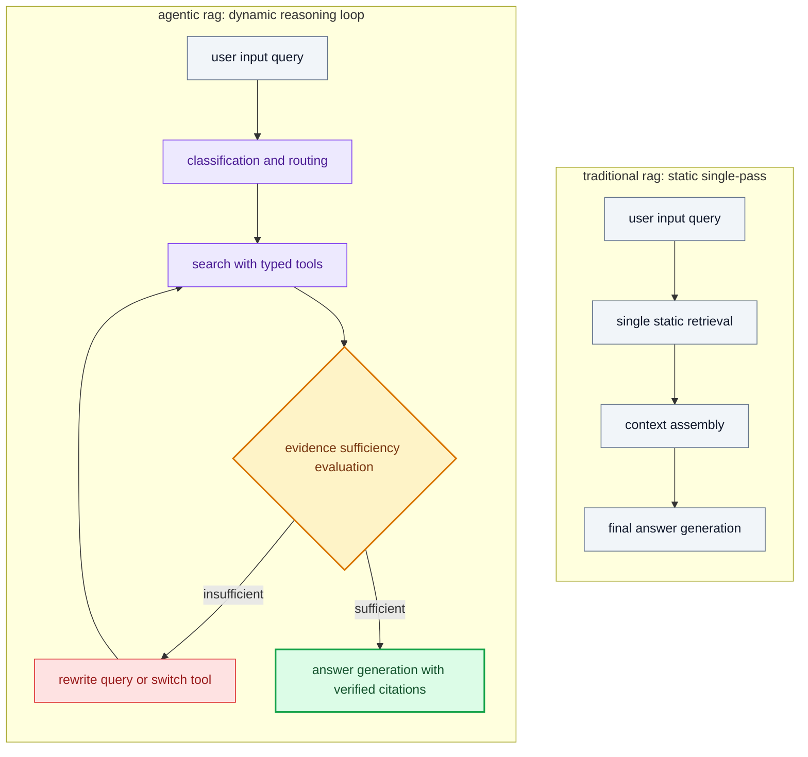

<div align="center">
  
</div>

<div align="center">
  <h1>agentic rag: hierarchical retrieval and reasoning</h1>
</div>

<div align="center">
  
  
  
  
  
</div>

<br />

this repository provides the official production-ready implementation of the technical tutorial:
https://regolo.ai/agentic-rag-tutorial-build-retrieval-that-reasons/

## overview

this repository provides an enterprise implementation of hierarchical agentic rag using the `brick-complexity-pro` endpoint on regolo. the system runs entirely on top of a local open source sqlite database, eliminating external vector hosting costs and complicated container setups.

> [!NOTE]
> this implementation runs out of the box with zero external infrastructure dependencies: all vector storage and relational foreign keys reside in a local sqlite database file.

## why hierarchical agency matters

standard single-pass rag pipelines execute one flat vector search that frequently fails on complex multi-hop questions, such as cross-document policy revisions or comparative audits. adding naive autonomous loops on top of flat vector stores inflates token costs by five to ten times without resolving underlying context omissions.

this repository demonstrates the disciplined 2026 production pattern through three core architectural principles:

- partition document storage into high-level parent summaries and granular child chunks to decouple thematic discovery from detailed evidence reading.
- deploy narrow typed tools that allow the model to search thematic indices first before requesting specific analytical paragraphs with unique identifiers.
- enforce strict iteration limits and execution timeouts to ensure that retrieval loops terminate predictably without runaway api costs.

## architecture

the following diagram illustrates how the hierarchical controller coordinates retrieval actions across parent and child tables:



## key capabilities

| capability | baseline flat rag | hierarchical agentic rag |
|---|---|---|
| index architecture | single flat chunk collection | two-level parent summaries and child chunks |
| retrieval control | static single-pass lookup | autonomous iterative tool reasoning |
| query handling | original text search | multi-step query refinement and tool switching |
| multi-hop synthesis | risks missing historical revisions | routes across multiple parent documents |
| prompt efficiency | dumps entire chunk sets | extracts only verified relevant sections |

## quick start

initialize your local virtual environment and install all dependencies using the green regolo setup script:

```bash
chmod +x setup.sh
./setup.sh
```

the script detects whether an existing `.venv` environment exists, creates one if missing, installs all required python dependencies, and presents the interactive options menu immediately.

> [!TIP]
> you can configure your regolo credentials in `.env` by copying `.env.example`:
> `regolo_api_key=your_api_key_here`

## execution options

after completing setup, you can explore the laboratory through two distinct interfaces:

### 1. interactive terminal interface

run the main program without arguments to launch the guided terminal menu:

```bash
source .venv/bin/activate
python3 main.py
```

the interactive interface allows developers to index custom document folders, run comparative evaluations, or verify sample policies directly from the terminal.

### 2. direct command-line execution

to automate document ingestion and evaluation directly from shell scripts, pass command line flags:

```bash
# ingest custom folder and compare on target inquiry
python3 main.py --path ./sample_data --query "compare the 2026 refund policy with 2025 and explain which exceptions changed."

# run the sample verification test
python3 main.py --sample-test
```

## local storage structure

the local sqlite database file `rag_storage.sqlite3` maintains two complementary representations of the document corpus:

- `baseline_chunks`: flat chunk table where documents are split into isolated chunks without parent-child relational links.
- `parent_summaries`: parent table storing high-level thematic summaries used by the controller to discover candidate files.
- `child_chunks`: analytical child table with relational foreign keys storing granular sections retrieved only when relevant.

this architectural decoupling allows `brick-complexity-pro` to call the typed tools `search_topic_index`, `read_chunk_details`, and `keyword_search` to gather factual proof without flooding the prompt context window.

## evaluation dashboard

when running comparisons, the application renders a colorful terminal user interface rather than raw markdown:

- visual metric cards highlighting execution latency, retrieval steps, and chunk count side by side.
- color-coded output boxes distinguishing single-pass baseline responses from iterative agentic synthesis.
- structured architectural diagnosis detailing why hierarchical retrieval successfully captures cross-document exceptions.
