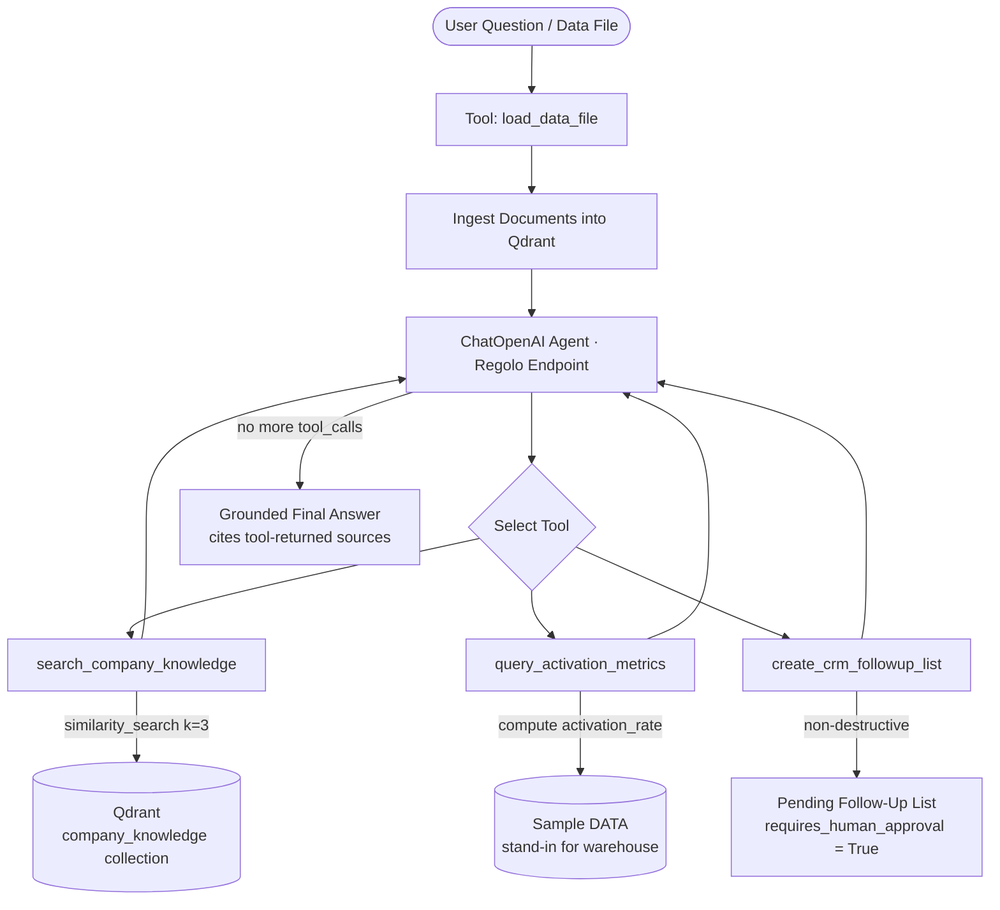

<div align="center">
  
</div>

# Controlled Analytics Assistant with LangChain, Qdrant & Regolo

**A bounded, safe-by-default AI analytics assistant that answers KPI questions through typed tools and non-destructive CRM actions — powered by Regolo.ai** — inspired by and fully detailed in the [Regolo Blog: Build a Controlled Analytics Assistant with LangChain, Qdrant, and Regolo](https://regolo.ai/build-a-controlled-analytics-assistant-with-langchain-qdrant-and-regolo/).

---

<p align="center">
  
  
  
  
</p>

---

## 📌 Table of Contents
- [📖 Introduction](#-introduction)
- [✨ Key Features](#-key-features)
- [🛠️ Technology Stack](#-technology-stack)
- [📐 Architecture Overview](#-architecture-overview)
- [📁 Project Structure](#-project-structure)
- [⚙️ Environment Variables](#️-environment-variables)
- [🚀 Getting Started](#-getting-started)
- [🧪 Testing & Benchmarks](#-testing--benchmarks)
- [📦 CI/CD Integration](#-cicd-integration)
- [🤝 Contributing](#-contributing)
- [📄 License](#-license)

---

## 📖 Introduction

This repository contains a complete, runnable implementation of a **controlled Analytics Assistant** built on top of **LangChain**, **Qdrant**, and the **Regolo.ai** OpenAI-compatible inference platform.

Rather than exposing a generic, unconstrained chatbot, the assistant answers operational KPI questions by combining three **bounded, typed capabilities**:

1. **Company-policy retrieval** from a Qdrant vector store (metric definitions, operating rules, CRM action policy).
2. **Metric lookup** through a typed `query_activation_metrics` tool — a stand-in for a warehouse or BI semantic layer.
3. **Non-destructive CRM workflow** — the only permitted write action is creating a follow-up list, which always requires human approval before outreach.

The model decides *which* allowed tool to use; the application decides *what each tool can do*. This preserves useful multi-tool behavior while making automation measurable: tool success rate, grounded-answer rate, activation-analysis completion rate, and approved-list-to-outreach conversion.

---

## ✨ Key Features

- 🎯 **Bounded, Typed Tools**: Every external capability (`search_company_knowledge`, `query_activation_metrics`, `create_crm_followup_list`) is a typed LangChain `@tool`. The model cannot reach capabilities that are not explicitly exposed.
- 🛡️ **Safe-by-Default CRM Action**: The `create_crm_followup_list` tool is deliberately non-destructive — it never sends messages, edits records, or changes account owners. Every list it creates carries `requires_human_approval_for_outreach: True`.
- 📚 **Qdrant Knowledge Retrieval**: Operational context (metric glossaries, growth playbooks, CRM policy) is indexed in Qdrant and retrieved via semantic similarity search, grounding answers in source-cited company documents.
- 🔢 **Structured Metric Layer**: `query_activation_metrics` returns weekly activation metrics grouped by segment, with activation rates pre-computed — a clean stand-in for a parameterised warehouse query.
- 🧩 **Multi-Format Data Ingestion**: `load_data_file` validates and ingests `.csv`, `.txt`, and `.xlsx` files into the Qdrant knowledge base, raising explicit errors on missing, empty, or unsupported inputs.
- ⚙️ **Developer-Friendly CLI**: `setup.sh` provides a menu-driven, fully automated setup CLI to manage the Python virtual environment (`.venv`), configure `.env` credentials, start Qdrant (via Docker), run tests, and launch the application.
- 🧪 **Deterministic Component Tests**: `test_app.py` validates retrieval grounding, metric calculation, CRM non-destructiveness, and data-file loading — all runnable without spending API credits.

---

## 🛠️ Technology Stack

* **Language**: [Python 3.10+](https://www.python.org/)
* **Agent Framework**: [LangChain (langchain-core >= 0.3)](https://github.com/langchain-ai/langchain)
* **LLM Client**: [langchain-openai (>= 0.3)](https://github.com/langchain-ai/langchain) — OpenAI-compatible
* **Vector Store**: [Qdrant (langchain-qdrant >= 0.2, qdrant-client >= 1.10)](https://github.com/qdrant/qdrant)
* **Spreadsheet Parsing**: [openpyxl (>= 3.1)](https://openpyxl.readthedocs.io/) for `.xlsx` ingestion
* **Testing**: [pytest (>= 8.0)](https://docs.pytest.org/)
* **Configuration**: [python-dotenv (>= 1.0)](https://github.com/theskumar/python-dotenv)
* **Compatible Endpoints**: Built to interact with [Regolo.ai GPU endpoints](https://regolo.ai/), as well as any standard OpenAI-compatible API (OpenAI, Together.ai, Groq, Ollama, vLLM, LM Studio, etc.).

---

## 📐 Architecture Overview

The system operates as a single-turn agent loop that grounds every answer in tool-returned evidence.



### Flow Breakdown
1. **Data Ingestion**: The user provides a data file (`.csv`, `.txt`, `.xlsx`). `load_data_file` validates, parses, and appends the records to the Qdrant knowledge base.
2. **Agent Invocation**: `ChatOpenAI` (bound to the three typed tools) receives the question plus a system prompt that forbids inventing results and restricts CRM actions to follow-up list creation.
3. **Tool Selection**: The model decides which allowed tool(s) to call for each turn, up to a maximum of 6 tool rounds.
4. **Grounded Retrieval**: `search_company_knowledge` performs a k=3 similarity search against Qdrant and returns source-cited snippets (`metrics_glossary.md`, `growth_playbook.md`, `crm_policy.md`).
5. **Metric Lookup**: `query_activation_metrics` returns weekly activation metrics with pre-computed rates — a safe stand-in for a parameterised warehouse query.
6. **Safe CRM Action**: `create_crm_followup_list` returns a pending list flagged for human approval; it never contacts anyone or mutates records.
7. **Final Answer**: Once the model emits no further tool calls, the grounded, source-cited answer is returned to the user.

---

## 📁 Project Structure

```text
analytics-assisant-chromadb-qdrant/
├── app.py                 # Agent loop, typed tools, data-file ingestion & live run
├── knowledge_base.py      # Demo policy documents (glossary, playbook, CRM policy)
├── test_app.py            # Deterministic tests for tools & data-file loading
├── setup.sh               # Branded interactive CLI for env, Qdrant, tests & app
├── requirements.txt       # Core project dependencies
└── .env.example           # Template for API credentials and Qdrant config
```

---

## ⚙️ Environment Variables

Copy `.env.example` to `.env` and fill in your values:

```bash
cp .env.example .env
```

| Variable | Required/Optional | Default Value | Description |
| :--- | :--- | :--- | :--- |
| `REGOLO_API_KEY` | **Required** | - | API key for Regolo or other OpenAI-compatible backends |
| `REGOLO_MODEL` | Optional | `gpt-oss-120b` | Model identifier (must support tool/function calling) |
| `OPENAI_BASE_URL` | Optional | `https://api.openai.com/v1` | Custom endpoint base URL (e.g. `https://api.regolo.ai/v1`) |
| `QDRANT_URL` | Optional | `http://localhost:6333` | Remote Qdrant instance URL (Docker) |
| `QDRANT_PATH` | Optional | `.qdrant` | Local Qdrant storage path used when no remote URL is reachable |

---

## 🚀 Getting Started

### 1. Prerequisites
- **Python 3.10 or higher** installed on your system.
- **Docker** (optional, recommended if you wish to run Qdrant via the CLI).
- A **Regolo.ai API key** (or any OpenAI-compatible endpoint) whose model supports tool/function calling.

### 2. Automatic Setup & Execution
The quickest way to get up and running is to use the interactive CLI.

```bash
# Make the management script executable
chmod +x setup.sh

# Start the interactive CLI manager
./setup.sh
```

Within the CLI menu, choose:
- **Option 1 (Setup Environment)**: Creates the Python virtual environment (`.venv`), installs all dependencies in `requirements.txt`, writes `.env` credentials, and starts Qdrant via Docker on port `6333`.
- **Option 2 (Start Qdrant)**: Launches the Qdrant vector database container.
- **Option 3 (Run Tests)**: Activates the virtual environment and runs the deterministic component test suite.
- **Option 4 (Run Application)**: Launches the interactive analytics assistant.

### 3. Manual Installation
If you prefer to configure the environment manually:

```bash
# Create and activate virtual environment
python3 -m venv .venv
source .venv/bin/activate

# Upgrade packaging tools and install requirements
pip install --upgrade pip
pip install -r requirements.txt

# Configure your environment variables
cp .env.example .env
# Edit .env with your favorite editor
```

### 4. Running the Assistant
Launch the interactive agent, provide a data file, and ask a question (or press Enter to use the default):

```bash
python app.py
```

The default question demonstrates the full closed loop: *"Compare activation in 2026-W29 with 2026-W28. Use the glossary, explain the largest decline, and create a CRM follow-up list for the affected segment."*

---

## 🧪 Testing & Benchmarks

The project ships with **deterministic component tests** that validate the tools, retrieval grounding, and data-file ingestion without spending any API credits.

```bash
# Run the full deterministic test suite
pytest -q

# Or run a specific test
pytest test_app.py::test_crm_tool_is_non_destructive -v
```

**What is tested:**
- `search_company_knowledge` returns source-cited results (e.g. `metrics_glossary.md`).
- `query_activation_metrics` computes `activation_rate` correctly.
- `create_crm_followup_list` is non-destructive and flags `requires_human_approval_for_outreach: True`.
- `load_data_file` rejects missing, empty, and unsupported files, and correctly parses `.csv`, `.txt`, and `.xlsx`.

---

## 📦 CI/CD Integration

To run the Analytics Assistant and its test suite within your continuous integration workflow, incorporate the following step into your pipeline definition.

Example snippet for **GitHub Actions** (`.github/workflows/ci.yml`):

```yaml
name: Analytics Assistant CI
on: [push, pull_request]

jobs:
  test:
    runs-on: ubuntu-latest
    steps:
      - name: Checkout repository
        uses: actions/checkout@v4

      - name: Set up Python
        uses: actions/setup-python@v5
        with:
          python-version: '3.10'

      - name: Initialize Environment
        run: |
          chmod +x analytics-assisant-chromadb-qdrant/setup.sh
          ./analytics-assisant-chromadb-qdrant/setup.sh setup

      - name: Run Deterministic Tests
        run: |
          source analytics-assisant-chromadb-qdrant/.venv/bin/activate
          pytest analytics-assisant-chromadb-qdrant/test_app.py -q
```

For a live end-to-end agent run, configure your `.env` with a valid API key and a function-calling model:

```yaml
      - name: Run Live Agent
        env:
          REGOLO_API_KEY: ${{ secrets.REGOLO_API_KEY }}
          OPENAI_BASE_URL: https://api.regolo.ai/v1
          REGOLO_MODEL: gpt-oss-120b
        run: |
          source analytics-assisant-chromadb-qdrant/.venv/bin/activate
          python analytics-assisant-chromadb-qdrant/app.py
```

---

## 🤝 Contributing

We welcome contributions to expand and improve the Analytics Assistant!
1. **Extend Tools**: Add bounded, typed tools in `app.py` (e.g. cohort analysis, anomaly detection) while preserving safe-by-default semantics.
2. **Expand the Knowledge Base**: Enrich `knowledge_base.py` with additional operational policies and metric definitions.
3. **Harden Production Readiness**: Replace the in-process `DATA` lookup with a read-only analytics service that enforces tenant, role, and date filters, and retain human approval for every external CRM action.

---

## 📄 License

Distributed under the MIT License. See [LICENSE](../LICENSE) for more information.
