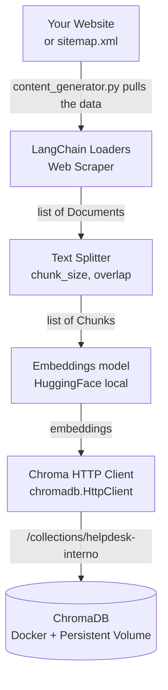
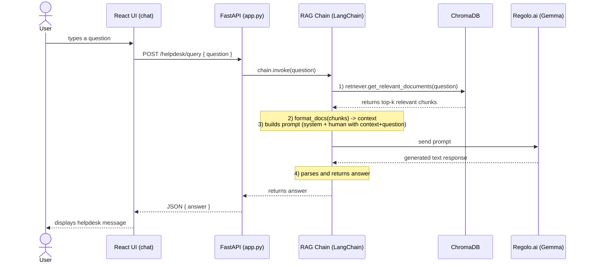

<div align="center">
  
</div>

# RAG chatbot widget for websites, auto-updated by sitemap, with ChromaDB + LangChain

<div align="center">
  
  
  
  
  
  
</div>

<br />

**Imagine having a tireless, super-smart support agent on your website that knows every detail of your business, 24/7.** 

This project is a complete, ready-to-use Artificial Intelligence chatbot that you can easily embed on your website (for your customers) or use internally (for your employees). You just provide your company documents (PDFs, text files, or even link it to your website), and the AI will answer questions instantly and accurately based *only* on your data.

<div align="center">
  <a href="https://www.youtube.com/watch?v=QoJkmWUjaYc" target="_blank">
    
  </a>
  <p><em>🎥 <a href="https://www.youtube.com/watch?v=QoJkmWUjaYc" target="_blank">Click to watch the full step-by-step video tutorial on YouTube</a></em></p>
</div>

> [!IMPORTANT]  
> ## Sign Up and get 30 Days Free Trial
> 
> To power your AI agent, you need an API key. Sign up for Regolo today and get **30 days completely free**, plus a massive **70% discount for the following 3 months!**
> 
> 🚀 **[CLICK HERE TO GET STARTED AND CLAIM YOUR FREE TRIAL](https://regolo.ai/pricing)** 🚀
> 
> ---
> **Explore Regolo:** [Platform](https://regolo.ai) | [Models Library](https://regolo.ai/models-library/) | [Documentation & Guides](https://regolo.ai/docs) | [YouTube](https://www.youtube.com/@regoloai) | [Discord](https://discord.gg/wHxwWCC8)

## 🌟 Why use this instead of Intercom or Zendesk?

Famous customer support tools like **Intercom**, **Zendesk**, or **Drift** are fantastic, but they come with a massive catch: they are **highly expensive**. They often charge hundreds of dollars per month, plus extra premium fees for their "AI add-ons", and charge you per-agent seat.

**With this open-source project, you get a premium AI chat experience almost for FREE:**
- 💰 **Zero Monthly Subscriptions:** You own the code and host it yourself. You don't pay a fixed monthly fee. You only pay fractions of a cent for the actual AI text generation via [Regolo.ai](https://regolo.ai) APIs.
- 🔄 **Auto-Updating Knowledge Base:** The system can be configured to automatically read your website or internal folders every *N* hours/days. If you publish a new product, update a price, or change a policy on your site, the chatbot automatically updates its brain! No manual training required.
- 🔒 **Total Data Control:** Your documents are safely stored in your own local vector database (ChromaDB). You aren't forced to hand over your company data to third-party SaaS platforms.
- 🧠 **Human-like Understanding:** Powered by state-of-the-art open-weight models, it doesn't just give robotic "Click here" answers; it understands context and holds natural conversations.

---

## 🛠️ For Developers: Project Structure & Architecture

The system is composed of several modular Python scripts and a React frontend, working together to ingest documents and serve answers using an LLM.

### File Structure
* **`cache/`**: Local cache directory where HuggingFace downloads embedding models.
* **`app.py`**: The main FastAPI backend server exposing the `/helpdesk/query` endpoint.
* **`content_generator.py`**: A standalone robust script that auto-updates your knowledge base by scraping your website/sitemap, chunking content, and saving embeddings directly to ChromaDB.
* **`rag_chain.py`**: LangChain pipeline (LCEL) definition that glues together the retriever, the prompt, and the LLM.
* **`llm_langchain.py`**: Configures the LLM using the OpenAI-compatible API from Regolo.ai.
* **`retriever.py`**: Configures the ChromaDB retriever using local HuggingFace embeddings.
* **`chroma_client.py`**: Simple HTTP client setup to connect to the Dockerized ChromaDB.
* **`test_rag.py`**: A CLI tool to test the RAG chain directly in the terminal without starting the web server.
* **`docker-compose.chroma.yml`**: Docker Compose file to spin up ChromaDB.
* **`autoupdate-agent-ui/`**: React + Vite frontend application for the chat interface.

### Tech Stack
- **LLM**: Gemma  via **Regolo.ai** (OpenAI compatible API).
- **Vector DB**: **ChromaDB** running in Docker.
- **Orchestration**: **LangChain** for RAG pipeline (retriever + prompt + LLM).
- **Backend**: **FastAPI** serving REST endpoints.
- **Frontend**: **React + Vite** for a modern chat UI.

---

## 1. Auto-Updating Ingestion Flow



--- 

## 2. Request/Response Flow (RAG)



---

## 3. Prerequisites

- Python **3.10+**
- Node.js **18+**
- Docker + Docker Compose
- **Regolo.ai API Key**: You need an active API key to query the LLMs.
  🚀 **Sign up for free at [Regolo.ai](https://regolo.ai) to get your API key immediately and start building!**

---

## 4. Environment Setup

### 4.1. Create virtualenv and install dependencies

```bash
python -m venv .venv
source .venv/bin/activate  # On Windows: .venv\Scripts\activate

pip install -r requirements.txt
```

### 4.2. Set Environment Variables

Create a `.env` file in the root directory:

```env
# Get your free key at https://regolo.ai
REGOLO_API_KEY=your_regolo_api_key
REGOLO_BASE_URL=https://api.regolo.ai/v1
REGOLO_MODEL=gemma4-31b

# Configuration for Knowledge Base Auto-Update
KNOWLEDGE_BASE_URL=https://regolo.ai/sitemap_index.xml
AUTO_UPDATE_HOURS=24
```

- `KNOWLEDGE_BASE_URL`: The URL of the website or sitemap that the AI needs to scrape.
- `AUTO_UPDATE_HOURS`: How frequently (in hours) the server should auto-scrape the website in the background to update its knowledge (e.g., `24` for daily, `0.5` for every 30 minutes).

---

## 5. Running the Application

### 5.1. Start ChromaDB (Docker)

```bash
docker compose -f docker-compose.chroma.yml up -d
```
- ChromaDB API will be at `http://localhost:8000`

### 5.2. Populate the database (Auto-Update)

The system manages data ingestion automatically! 

When you start the `app.py` server, FastAPI will read `KNOWLEDGE_BASE_URL` and `AUTO_UPDATE_HOURS` from your `.env` file. It will spawn a silent background process that:
1. Downloads the sitemap or website contents.
2. Splits them into vector chunks.
3. Completely replaces the ChromaDB database with fresh knowledge.

You don't need to manually configure Linux Cron jobs or interact with terminals. If you ever need to manually force an immediate update without waiting for the timer, simply run:
```bash
python content_generator.py
```
*(Check `content_generator_log.txt` for live details of the scraping process!)*

### 5.3. Start the FastAPI Backend

```bash
uvicorn app:app --reload
```
The API will run on `http://localhost:8000/helpdesk/query` (Note: ChromaDB uses 8000 inside docker, so you might want to run uvicorn on another port if there's a conflict, e.g., `uvicorn app:app --port 8080`).

### 5.4. Start the React Frontend

In a NEW terminal:

```bash
cd autoupdate-agent-ui
npm install   # Only the first time
npm run dev
```

### Optional: Test via CLI

If you just want to test the RAG engine without starting the web UI or API, you can use:
```bash
python test_rag.py
```

---

## 6. Embed on Your Website (Widget Customization)

The React interface (`autoupdate-agent-ui`) is configured to produce a single JavaScript file and a single CSS file, making it extremely easy to inject the app into a host website as a floating widget.

### 6.1 How to build the widget (Done automatically by start.sh)
Navigate to the `autoupdate-agent-ui` folder and run the build:
```bash
cd autoupdate-agent-ui
npm run build
```
This will generate the necessary files in the `autoupdate-agent-ui/dist/` folder (e.g., `chat-widget.js` and `chat-widget.css`).

### 6.2 How to embed it in your host website
Insert these HTML tags into your website where you want the chat to appear (preferably just before the closing `</body>` tag):
```html
<link rel="stylesheet" href="https://YOUR_DOMAIN/chat-widget.css">
<script type="module" src="https://YOUR_DOMAIN/chat-widget.js"></script>
```

### 6.3 Customizing the style

If you need to make changes to the chat interface or the test site:

1. **Text Variables (Env File in `autoupdate-agent-ui/.env`)**
   - Edit the `.env` file inside `autoupdate-agent-ui` to change the Bot Name, Subtitle, Greeting, and Placeholder in seconds without touching any code.
   
2. **Structure and Main Colors (`autoupdate-agent-ui/src/App.tsx`)**
   - Edit the inline styles if you want to change the layout, icon, and colors of the floating button or the panel.
   
3. **Global Variables and Text Bubbles (`autoupdate-agent-ui/src/index.css`)**
   - Change the background colors of the messages and the Markdown style.

4. **Dummy Test Site (`autoupdate-agent-ui/test-embed.html`)**
   - A fake page used only to test the widget locally. You can modify it freely to simulate your own website.

> **Golden Rule:** After every modification, re-run `start.sh` (or `npm run build` inside `autoupdate-agent-ui`) so that the changes take effect in the generated JS file.

