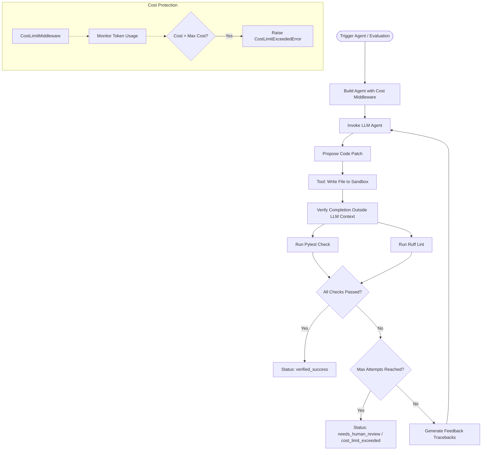

<div align="center">
  
</div>

# Closed‑Loop Code Reviewer & CI Repair Agent

**A fast, deterministic, self-healing Python code repair pipeline powered by Regolo.ai** – inspired by and fully detailed in the [Regolo Blog: Agent Harness – Evaluate Efficiency in Production](https://regolo.ai/agent-harness-evaluate-efficiency-production/).

---

<p align="center">
  
  
  
  
</p>

<div align="center">
  <a href="https://youtu.be/56c7348w-G4">
    
  </a>
</div>

---

## 📌 Table of Contents
- [📖 Introduction](#-introduction)
- [✨ Key Features](#-key-features)
- [🛠️ Technology Stack](#-technology-stack)
- [📐 Architecture Overview](#-architecture-overview)
- [📁 Project Structure](#-project-structure)
- [⚙️ Environment Variables](#️-environment-variables)
- [🚀 Getting Started](#-getting-started)
- [🧪 Testing \& Benchmarks](#-testing--benchmarks)
- [📦 CI/CD Integration](#-cicd-integration)
- [🤝 Contributing](#-contributing)
- [📄 License](#-license)

---

## 📖 Introduction

This repository contains the complete implementation of the **Regolo.ai Closed‑Loop CI Repair Agent**. It showcases an agentic software development pattern where a **LangChain** and **LangGraph** agent acts inside a protected sandboxed environment to automatically diagnose, modify, and repair buggy Python code. 

Rather than relying on the LLM's own assessment of whether a patch is correct, the harness runs standard verification tooling (`pytest` and `ruff`) **completely outside the model's context**. Detailed tracebacks, execution logs, and linting failures are recursively fed back to the agent as objective feedback, allowing it to iteratively self-correct up to a configurable budget.

---

## ✨ Key Features

- ❄️ **Closed-Loop Verification**: Dispatches external, objective testing tools (`pytest`) and code-quality scanners (`ruff`) to validate the agent's proposed code changes before accepting them.
- 💸 **Token-Level Cost Guardrails**: Employs a custom `CostLimitMiddleware` (derived from LangChain's middleware class) to intercept every model request, track accumulated cost based on input/output tokens, and instantly halt if the configured budget (e.g., $1.00) is exceeded.
- 🔁 **Iterative Self-Correction**: When tests or linters fail, detailed error logs and terminal outputs are parsed, structured, and injected into the agent's session memory as corrective feedback.
- 🛡️ **Path Sandboxing & Safety**: Implements strict write-protection rules to block the agent from modifying critical system and pipeline areas, including `.github/`, `infra/`, `terraform/`, and database migration directories.
- ⚙️ **Developer-Friendly CLI**: `scripts/regolo.sh` provides a menu-driven, fully automated setup CLI to manage python virtual environments (`.venv`), diagnose service status, and execute projects safely.
- 📊 **Comprehensive Evaluation & Benchmarking**: Includes a custom benchmark runner (`evaluation.py`) that executes multiple debugging tasks defined in `tasks.json`, measuring success rates, costs, and timings.

---

## 🛠️ Technology Stack

* **Language**: [Python 3.10+](https://www.python.org/)
* **Agent Framework**: [LangChain (>=1.0.0)](https://github.com/langchain-ai/langchain) and [LangGraph (>=0.2.0)](https://github.com/langchain-ai/langgraph)
* **LLM Client**: [langchain-openai (>=0.2.0)](https://github.com/langchain-ai/langchain)
* **Testing & Feedback**: [pytest (>=8.0.0)](https://docs.pytest.org/) and [ruff (>=0.6.0)](https://github.com/astral-sh/ruff)
* **Performance Benchmark**: [pytest-benchmark (>=5.1.0)](https://pytest-benchmark.readthedocs.io/)
* **Compatible Endpoints**: Built to interact with [Regolo.ai GPU endpoints](https://regolo.ai/), as well as any standard OpenAI-compatible API (Together.ai, Groq, Ollama, vLLM, LM Studio, etc.).

---

## 📐 Architecture Overview

The system operates as a classic feedback loop separated into three main layers: **Orchestrator**, **LLM Agent**, and **External Sandbox Verification**.



### Flow Breakdown
1. **Agent Invocation**: The orchestrator launches the agent with an issue description.
2. **Patch & Write**: The agent utilizes `read_file` to analyze code and `write_file` to apply edits within a protected target repository sandboxed environment.
3. **Objective Verification Gate**: The system runs `verify_completion()`. This step does not trust the LLM; instead, it executes `pytest` and `ruff` natively.
4. **Self-Correction Feedback Loop**: If verification fails, the orchestrator compiles a detailed, structured feedback report containing full traceback details and passes it to the agent for the next attempt.
5. **Budget Safeguards**: Throughout the loop, `CostLimitMiddleware` intercepts each step to protect against runaway costs and infinite agent loops.

---

## 📁 Project Structure

```text
ci-repair-agent/
├── agent.py                 # Self-verification loop, cost middleware & agent builder
├── config.py                # Handles loading env vars and building the ChatOpenAI client
├── tools.py                 # Sandbox-safe tools (read, write, pytest, ruff, mypy, git_diff)
├── evaluation.py            # Automated task runner for batch benchmarks & evaluation
├── requirements.txt         # Core project dependencies
├── pytest.ini               # pytest configuration
├── .env.example             # Template for API credentials and agent budgets
│
├── benchmarks/
│   └── tasks.json           # Defined coding challenges for agent evaluations
│
├── scripts/
│   └── regolo.sh            # Branded environment setup and management CLI
│
├── target-repo/             # Reference buggy workspace used as a repair sandbox
│   ├── app/
│   │   ├── __init__.py
│   │   └── user_service.py  # Target file where bugs are diagnosed and fixed
│   ├── tests/
│   │   ├── __init__.py
│   │   └── test_users.py    # Target tests demonstrating bugs
│   └── pyproject.toml       # Linter configuration for the sandbox repo
│
└── tests/                   # Internal testing suite for pipeline components
    ├── __init__.py
    ├── test_tools.py        # Validates tool safety and folder escaping prevention
    ├── test_harness_gate.py # Checks deterministic feedback compilation
    ├── test_evaluation.py   # Verifies loading of tasks and status checking
    └── test_benchmark.py    # Tracks pipeline component benchmarks
```

---

## ⚙️ Environment Variables

Copy `ci-repair-agent/.env.example` to `.env` and fill in your values:

```bash
cp .env.example .env
```

| Variable | Required/Optional | Default Value | Description |
| :--- | :--- | :--- | :--- |
| `OPENAI_API_KEY` | **Required** | - | API key for Regolo or other OpenAI-compatible backends |
| `OPENAI_BASE_URL` | Optional | `https://api.regolo.ai/v1` | Custom endpoint base URL (supports Together, Ollama, etc.) |
| `OPENAI_MODEL` | Optional | `qwen3.5-9b` | Model identifier to use for the repair workflow |
| `TARGET_REPO_PATH` | Optional | `./target-repo` | Relative path to the folder containing buggy code to repair |
| `AGENT_MAX_ATTEMPTS` | Optional | `3` | Maximum self-correction repair attempts for a single task |
| `AGENT_MODEL_CALL_LIMIT` | Optional | `12` | Total LLM model call budget allocated per issue |
| `AGENT_TOOL_CALL_LIMIT` | Optional | `30` | Maximum number of tool operations allowed per issue |
| `INPUT_COST` | Optional | `0.07` | Cost per 1,000 input tokens ($) for model budget tracking |
| `OUTPUT_COST` | Optional | `0.35` | Cost per 1,000 output tokens ($) for model budget tracking |
| `MAX_COST` | Optional | `1.00` | Hard cap cost limit ($). Aborts execution if reached |

---

## 🚀 Getting Started

### 1. Prerequisites
- **Python 3.10 or higher** installed on your system.
- **Docker** (optional, recommended if you wish to run Qdrant or container diagnostics via the CLI).

### 2. Automatic Setup & Execution
The quickest way to get up and running is to use the interactive CLI.

```bash
# Make the management script executable
chmod +x scripts/regolo.sh

# Start the interactive CLI manager
./scripts/regolo.sh
```

Within the CLI menu, choose:
- **Option 1 (Set Environment)**: Automatically sets up the `.env` configuration file, creates a Python virtual environment (`.venv`), and installs all dependencies in `requirements.txt`.
- **Option 2 (Check Services)**: Performs health checks on Python, virtual environment configuration, and starts Qdrant (via Docker) on port `6333` if needed.
- **Option 3 (Run Project)**: Launches the evaluation pipeline.

### 3. Manual Installation
If you prefer to configure the environment manually:

```bash
# Create and activate virtual environment
python3 -m venv .venv
source .venv/bin/activate

# Upgrade packaging tools and install requirements
pip install --upgrade pip
pip install -r requirements.txt

# Configure your environment variables
cp .env.example .env
# Edit .env with your favorite editor
```

---

## 🧪 Testing & Benchmarks

The project is split into **offline component verification** and **live agent benchmarks**.

### Offline Component Tests
Verify the underlying self-verification loop mechanism, sandbox constraints, and feedback compilation without spending any API credits:

```bash
pytest tests/test_tools.py tests/test_harness_gate.py -v
```

### Live Agent Benchmarks
To evaluate the agent's ability to fix bugs under real conditions, configure your `.env` with a valid API key and run:

```bash
# Run the complete evaluation tasks
python3 evaluation.py

# Or directly run the benchmark tasks via JSON specification
python3 evaluation.py --tasks benchmarks/tasks.json
```

To assert performance benchmarks using `pytest-benchmark`:

```bash
PYTHONPATH=. pytest tests/test_benchmark.py --benchmark-only
```

---

## 📦 CI/CD Integration

To leverage the Regolo Closed-Loop Repair Agent within your continuous integration workflow to automatically fix failing tests, incorporate the following step into your pipeline definition. 

Example snippet for **GitHub Actions** (`.github/workflows/ci.yml`):

```yaml
name: CI Auto-Repair
on: [push, pull_request]

jobs:
  test_and_repair:
    runs-on: ubuntu-latest
    steps:
      - name: Checkout repository
        uses: actions/checkout@v4

      - name: Set up Python
        uses: actions/setup-python@v5
        with:
          python-version: '3.10'

      - name: Initialize Environment
        run: |
          chmod +x ci-repair-agent/scripts/regolo.sh
          # Set Environment builds the virtual env & installs dependencies
          ./ci-repair-agent/scripts/regolo.sh --setup

      - name: Run Auto-Repair Agent
        env:
          OPENAI_API_KEY: ${{ secrets.REGOLO_API_KEY }}
          OPENAI_BASE_URL: https://api.regolo.ai/v1
          OPENAI_MODEL: qwen3.5-9b
        run: |
          source ci-repair-agent/.venv/bin/activate
          python3 ci-repair-agent/evaluation.py
```

The agent will attempt to resolve any failing tests in your workspace and exit with status `0` upon verification success, or `1` if manual human intervention is required.

---

## 🤝 Contributing

We welcome contributions to expand and improve the Regolo CI Repair Agent!
1. **Extend Tools**: Enhance `tools.py` with custom developer tools (e.g., code searching, database inspection).
2. **Improve Sandbox Safety**: Upgrade file access validation and safety checks in `_resolve_safe_path`.
3. **Add Benchmarks**: Introduce new, diverse tasks in `benchmarks/tasks.json` representing common production bug patterns.

---

## 📄 License

Distributed under the MIT License. See [LICENSE](../LICENSE) for more information.
