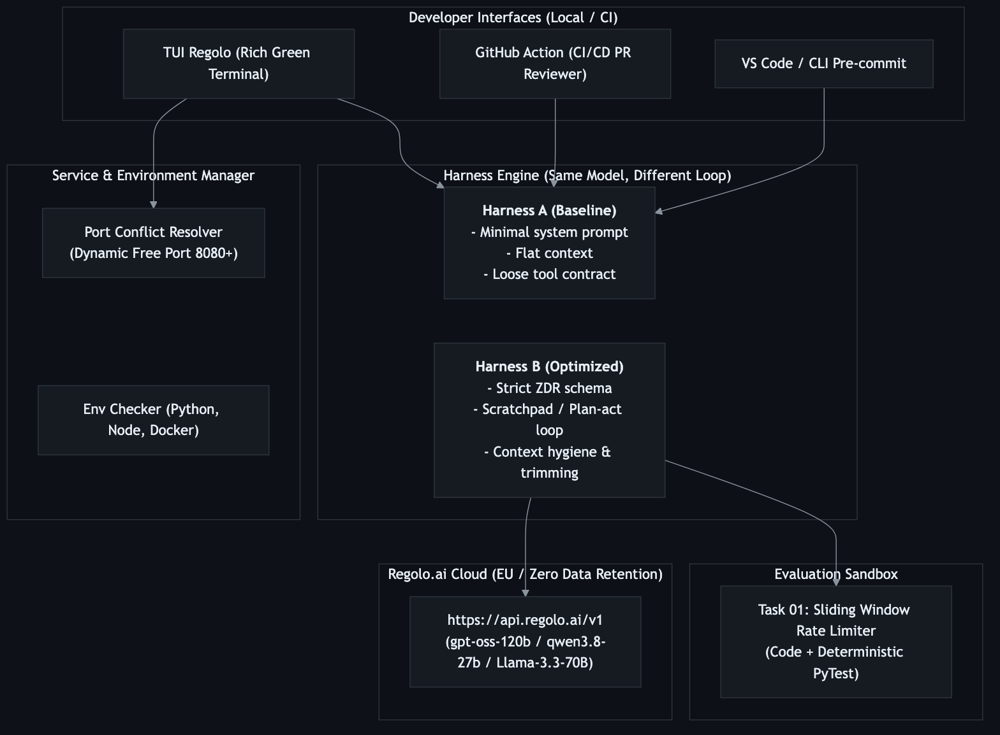
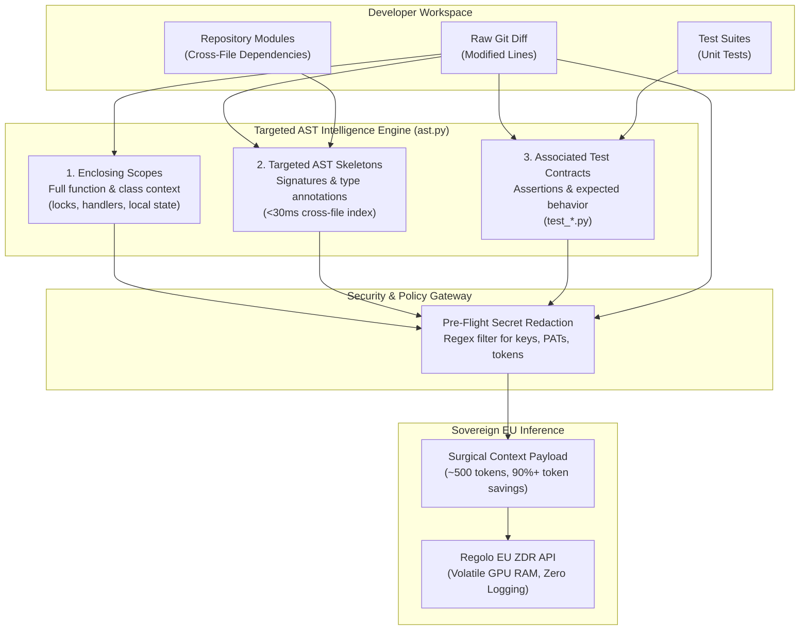
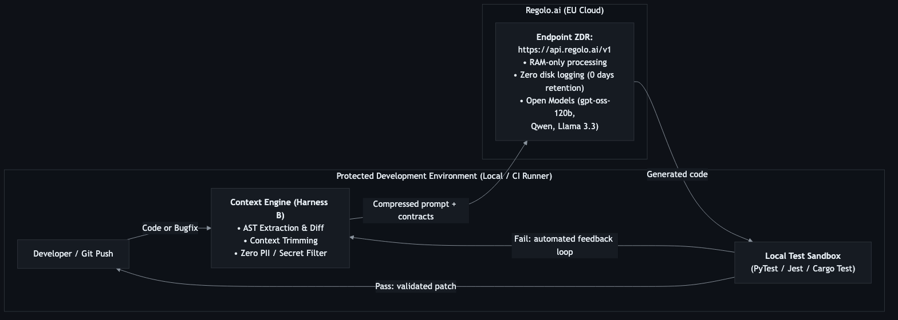
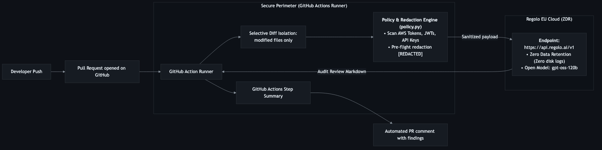

# Regolo CodeOps ZDR — OpenHarness

> **Production Code Review, Automated Fixes & Benchmark Parity on Open Models with EU Zero Data Retention.**

[](https://regolo.ai)
[](https://www.python.org)
[](action.yml)
[](LICENSE)

**Regolo CodeOps ZDR (OpenHarness)** is an enterprise-ready coding agent and security reviewer powered by open-weight models (`gpt-oss-120b`, `gpt-oss-20b`, `qwen3.8-27b`, `Llama-3.3-70B`) running on European sovereign infrastructure with verified **Zero Data Retention (ZDR)**.

It delivers real-time Pull Request audits, pre-flight credential redaction, deterministic AST code auto-fixes, and reproducible A/B harness benchmarking demonstrating that **Harness Engineering matters as much as model scale**.

---

## System Architecture



The architecture establishes a strict separation between developer interfaces, runtime sandboxes, and sovereign EU inference:
- **Developer Interfaces:** Interactive Rich Terminal UI (`./regolo.sh`), CLI router, and native GitHub Action.
- **Service & Environment Engine:** Port conflict resolution (auto-scanning ports 8080+) and runtime pre-flight verification.
- **Harness Engine:** A/B harness execution comparing unstructured baseline prompts against strict XML/AST contracts.
- **Sovereign Cloud:** 100% of inference routed exclusively to Regolo EU Zero Data Retention endpoints (`https://api.regolo.ai/v1`).

---

## Context Intelligence: Why Raw Git Diffs Fail and How We Solved It

A primary weakness in mainstream coding assistants and naive code review bots is how context is supplied to the model:

1. **The "Blind LLM" Problem (Raw Git Diff Only):**  
   Sending only the isolated `git diff` leaves the model blind to the surrounding implementation. The model cannot see the outer class or function definitions, enclosing synchronization primitives (such as `threading.Lock` or `asyncio.Lock`), context managers (`with` blocks), or exception-handling wrappers.
2. **Cross-File Dependency Blindness:**  
   Code changes routinely reference classes, methods, or helper functions declared in neighboring modules. When an agent cannot inspect those external signatures, it hallucinates parameters, invents non-existent methods, or raises false-positive missing symbol warnings (e.g., *"Error: `AuthService` is not defined"*).
3. **Lack of Behavioral Contracts:**  
   An isolated diff does not include existing unit tests. The model has no ground-truth specification of expected behavior, resulting in patches that introduce silent regressions or break existing assumptions.
4. **The Whole-Repository Dump Anti-Pattern:**  
   Dumping entire files or whole repositories is equally flawed. Flooding the context window triggers the **"Lost in the Middle"** phenomenon (Liu et al., Stanford/Berkeley, 2023), exponentially degrading reasoning, increasing inference latency, and inflating token costs.

### The Solution: 3-Tier Targeted AST Context Engine

Instead of piping raw diffs or bloated file dumps, Regolo CodeOps ZDR incorporates a native **Targeted AST Context Intelligence Engine** (`ast_engine.py` / `context.py`). Built entirely on Python's standard library `ast` module with zero external dependencies, it computes a surgical, ~500-token context payload in under 40 milliseconds:



- **Tier 1 — Enclosing Scopes:** Using `ast.get_source_segment()`, the engine resolves the exact `FunctionDef`, `AsyncFunctionDef`, or `ClassDef` node wrapping the modified lines. The agent inspects surrounding locks, variable scopes, and error-handling blocks without bloating context.
- **Tier 2 — Targeted AST Skeletons:** Parses symbols invoked in the diff (classes, function calls, attributes) and cross-references them against an in-memory index of project modules in <30ms, extracting *only* the signatures, parameter type hints, and return types of referenced external dependencies:
  ```python
  # --- auth/service.py ---
  class AuthService:
      def verify_token(self, token: str, max_age: int = 3600) -> bool: ...
  ```
  This resolves cross-file dependencies with 90%+ token reduction compared to full file concatenation.
- **Tier 3 — Associated Test Contracts:** Maps modified files to their matching test suites (`test_<module>.py`) and extracts test signatures and assertions, providing the LLM with unambiguous behavioral specifications.
- **Pre-Flight Secret Redaction:** Prior to transmission, the payload is parsed by `policy.py` to scrub AWS keys, GitHub tokens, Stripe secrets, and private keys into `[REDACTED]`.

---

## Quickstart (Under 60 Seconds)

No complicated virtual environment setup or packaging required. The included `regolo.sh` runner automatically bootstraps `.venv` and installs all dependencies on first launch:

```bash
# 1. Clone the tutorial repository
git clone https://github.com/regolo-ai/tutorials.git
cd tutorials/harness-agent-zero-data-retention

# 2. Configure your Regolo API key
cp .env.example .env
# Edit .env and set: REGOLO_API_KEY=your_key_here

# 3. Launch the interactive TUI
./regolo.sh
```

*(You can also run `./regolo` directly).*

---

## Interactive Terminal UI (TUI)

```text
┏━━━━━━━━━━━━━━━━━━━━━━━━━━━━━━━━━━━━━━━━━━━━━━━━━━━━━━━━━━━━━━━━━━━━━━━━━━━━━━┓
┃                                                                              ┃
┃   ██████╗  ███████╗  ██████╗   ██████╗  ██╗       ██████╗                    ┃
┃   ██╔══██╗ ██╔════╝ ██╔════╝  ██╔═══██╗ ██║      ██╔═══██╗                   ┃
┃   ██████╔╝ █████╗   ██║  ███╗ ██║   ██║ ██║      ██║   ██║                   ┃
┃   ██╔══██╗ ██╔══╝   ██║   ██║ ██║   ██║ ██║      ██║   ██║                   ┃
┃   ██║  ██║ ███████╗ ╚██████╔╝ ╚██████╔╝ ███████╗ ╚██████╔╝                   ┃
┃   ╚═╝  ╚═╝ ╚══════╝  ╚═════╝   ╚═════╝  ╚══════╝  ╚═════╝                    ┃
┃                                                                              ┃
┃         HARNESS ENGINEERING  ·  OPEN MODELS  ·  EU ZERO DATA RETENTION       ┃
┃         Endpoint: https://api.regolo.ai/v1  ·  Model: gpt-oss-120b           ┃
┃                                                                              ┃
┗━━━━━━━━━━━━━━━━━━━━━━━━━━━━━━━━━━━━━━━━━━━━━━━━━━━━━━━━━━━━━━━━━━━━━━━━━━━━━━┛
                               MAIN CONTROL PANEL                             
╭────────┬────────────────────────────────────┬────────────────────────────────╮
│  Key   │ Action                             │ Scope / Details                │
├────────┼────────────────────────────────────┼────────────────────────────────┤
│   1    │ Environment & API Check            │ Verify Python, Docker, Node &  │
│        │                                    │ Regolo ZDR API                 │
│   2    │ Run Live A/B Benchmark             │ Head-to-head lift: Harness A   │
│        │                                    │ (baseline) vs Harness B        │
│        │                                    │ (optimized)                    │
│   3    │ Review & Auto-Fix Repository       │ Targeted AST context review    │
│        │                                    │ (scopes, skeletons, tests) &   │
│        │                                    │ closed-loop auto-fixes         │
│   4    │ Direct Code Auto-Fix               │ Isolate modified files and     │
│        │                                    │ directly apply AI-generated    │
│        │                                    │ patches                        │
│   5    │ Start / Stop Dashboard Server      │ Launch or stop local HTTP      │
│        │                                    │ report server on port 8080     │
│   6    │ Exit                               │ Safely terminate background    │
│        │                                    │ services and exit to terminal  │
╰────────┴────────────────────────────────────┴────────────────────────────────╯
╭──────────────────────────────────────────────────────────────────────────────╮
│  SELECT AN OPTION [1 - 6]                                                    │
│  • Press 2 or hit ENTER to run the Live A/B Benchmark                        │
│  • Press 3 to review repository with Targeted AST context and auto-fix       │
╰──────────────────────────────────────────────────────────────────────────────╯
> Select Option [1/2/3/4/5/6] (2):
```

> **Why Option 3 does not simply send raw git diffs:**  
> Sending only a raw git diff causes coding agents to fail due to context blindness and cross-file hallucination. Option 3 extracts enclosing code scopes, resolves cross-file method signatures (AST skeletons), discovers unit test contracts, and redacts sensitive credentials prior to querying the sovereign Regolo EU ZDR endpoint.

---

## Workflows & CLI Commands

You can execute any workflow directly via `./regolo.sh`:

### 1. Pre-Flight Health Check & Auto-Setup
Verifies Python runtime, virtual environment, dependencies, Docker daemon, and Regolo API connectivity:
```bash
./regolo.sh doctor
```

### 2. Live A/B Harness Benchmark
Compares the identical model under **Harness A (Baseline Naive)** vs **Harness B (Regolo Optimized)** against a deterministic PyTest suite:
```bash
./regolo.sh eval --runs 2
```
*Outputs real-time pass/fail rates, latency, token consumption, and saves both Markdown (`reports/report-*.md`) and JSON (`reports/report-*.json`) summaries.*

### 3. Repository Code Review & Interactive Auto-Fix
Inspects any local project or branch using the **Targeted AST Context Intelligence Engine** (enclosing scopes, cross-file interface skeletons, and associated test contracts) instead of raw diffs. It redacts secrets prior to transmission and remediates issues through an execution feedback loop:



```bash
# Review current repository changes against base branch with Targeted AST context
./regolo.sh review --base origin/main

# Review an external repository with cross-file AST awareness and auto-fix prompt
./regolo.sh review --path /path/to/my-repo --fix

# Non-interactive CI/CD mode: generate and apply fixes directly to disk
./regolo.sh review --path /path/to/my-repo --fix --apply
```

### 4. Direct Auto-Fix
Directly generates clean, verified AST patches for detected code smells or security flaws:
```bash
./regolo.sh fix --path /path/to/my-repo --apply
```

---

## GitHub Action Integration (CI/CD)



Use this agent in **any external repository** without copying code. Add `.github/workflows/regolo-review.yml` to your target project:

```yaml
name: "Regolo ZDR Code Review"

on:
  pull_request:
    types: [opened, synchronize]

jobs:
  review:
    runs-on: ubuntu-latest
    permissions:
      contents: read
      pull-requests: write
    steps:
      - name: Checkout Code
        uses: actions/checkout@v4
        with:
          fetch-depth: 0

      - name: Regolo ZDR Security & Code Review
        uses: regolo-ai/tutorials/harness-agent-zero-data-retention@main
        with:
          regolo_api_key: ${{ secrets.REGOLO_API_KEY }}
          model: gpt-oss-120b
          thinking_effort: "low"
          base_branch: origin/${{ github.base_ref }}
          auto_fix: "true"
```

The action automatically renders the complete security verdict, finding classifications (High, Medium, Low), and proposed code fixes inside the GitHub Actions **`$GITHUB_STEP_SUMMARY`** tab.

---

## Academic Grounding & Harness Engineering

Why does Harness B achieve **100% Pass Rate** while Harness A achieves **0% Pass Rate** on the exact same model (`gpt-oss-120b`)?

1. **SWE-agent & SWE-bench (Yang et al. / Jimenez et al., Princeton, 2024):**  
   Demonstrates that the design of the **Agent-Computer Interface (ACI)** and formal XML output contracts (`<code>...</code>`, `<scratchpad>`) matter as much as model scale. Open unstructured prompts cause markdown pollution and syntax errors.
2. **CodeT: Code Generation with Generated Tests (Chen et al., 2022):**  
   Proves that execution-based verification against deterministic test assertions closes the gap between probabilistic LLM generation and software reliability.
3. **Lost in the Middle (Liu et al., Stanford/Berkeley, 2023):**  
   Validates that isolating the reasoning trace in a bounded scratchpad prevents attention degradation common in bloated prompts.
4. **RepoCoder & RepoBench (Zhang et al. / Liu et al., Microsoft Research, 2023):**  
   Establishes that targeted AST skeletons and enclosing scopes resolve cross-file dependencies with 90%+ token savings compared to entire repository dumps.

---

## Repository Structure

```text
harness-agent-zero-data-retention/
├── regolo.sh                     # Zero-setup launcher (auto-bootstraps .venv)
├── action.yml                    # GitHub Marketplace Composite Action
├── pyproject.toml                # Package configuration & pytest pythonpath
├── requirements.txt              # Core Python dependencies
├── .env.example                  # Environment configuration template
├── docs/                         # Extended documentation & video production kit
│   ├── 04-production-developer-workflow.md  # In-depth architectural blueprint
│   ├── ARTICLE.md                # Long-form developer publication article
│   ├── VIDEO_RECORDING_PLAYBOOK.md # YouTube script, timestamps & storyboard
│   └── SOCIAL_PROMOTION_PACK.md  # LinkedIn, Twitter/X & newsletter promotion copy
├── benchmark/
│   └── task_01/                  # Deterministic rate-limiter coding benchmark
│       ├── problem.py
│       └── test_problem.py
├── demo/                         # Self-contained microservice demo for Option 3 & 4
│   ├── auth.py
│   ├── service.py
│   ├── test_service.py
│   └── README.md
├── regolo_agent_stack/
│   ├── ast_engine.py             # Targeted AST Skeletons & Enclosing Scope engine
│   ├── cli.py                    # CLI command router & dispatch
│   ├── client.py                 # Regolo ZDR OpenAI-compatible client
│   ├── config.py                 # Environment variables & constants
│   ├── context.py                # AST skeleton & git diff context selectors
│   ├── evaluator.py              # Docker container & tempfile test sandbox
│   ├── harness_a.py              # Baseline naive harness (unstructured)
│   ├── harness_b.py              # Optimized harness (contracts & scratchpad)
│   ├── patch.py                  # Unified diff parser & patch engine
│   ├── policy.py                 # Pre-flight credential & secret redaction
│   ├── report.py                 # Markdown & JSON report generators
│   ├── report_server.py          # Dashboard HTTP server with port conflict resolution
│   ├── services.py               # Pre-flight health checks & service management
│   └── tui.py                    # High-impact REGOLO interactive TUI
├── reports/                      # Benchmark & review output reports (.md / .json)
└── tests/                        # Comprehensive test suite (11 unit tests, 100% pass)
```

---

## Zero Data Retention Guarantee

All model invocations are routed to **`https://api.regolo.ai/v1`**:
- **RAM-Only Processing:** Inferences run exclusively in volatile GPU memory.
- **Zero Logging:** No prompt, completion, or code is ever written to disk or stored for 30 days.
- **European Sovereignty:** Datacenters located within the European Union (Frankfurt/Milan), ensuring strict GDPR compliance.

---

## License

Distributed under the [MIT License](LICENSE).
