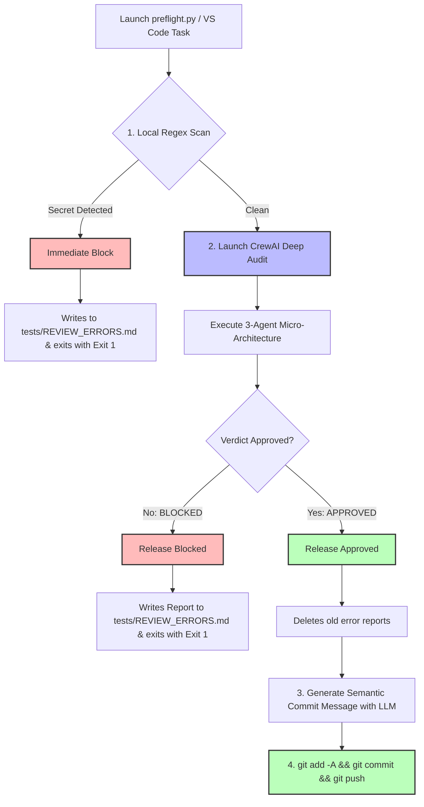
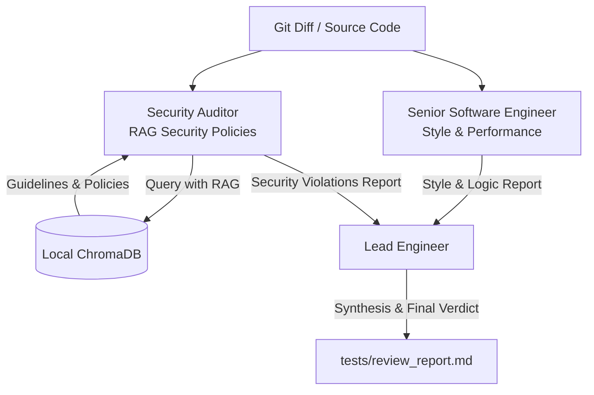

<div align="center">
  

  # Enterprise AI Code Review & Security Audit | 80% Lower Cost, Private RAG, DevOps Ready
  ### *Automated DevSecOps with CrewAI, Regolo AI (Zero Data Retention) and ChromaDB (RAG)*

  <p align="center">
    <a href="https://www.python.org"></a>
    <a href="https://regolo.ai"></a>
    <a href="https://www.crewai.com"></a>
    <a href="https://www.trychroma.com"></a>
    <a href="https://regolo.ai/pricing"></a>
  </p>
</div>

---

## Video Tutorial & Walkthrough

Watch the complete video guide on YouTube explaining the installation, interactive setup wizard, and native VS Code integration:

<div align="center">
  <a href="https://www.youtube.com/watch?v=8VE8UZiPIFA">
    
  </a>
  <br />
  <strong><a href="https://www.youtube.com/watch?v=8VE8UZiPIFA">Watch the Full Video Tutorial on YouTube</a></strong>
</div>

---

## Project Overview

This repository contains an **automated, private Code Review & Security Audit system**, designed for engineering teams and CTOs who want to enforce security compliance and code quality before releasing software (e.g., in Pull Requests) without compromising corporate intellectual property (IP).

The system is powered by **CrewAI** for multi-agent orchestration, **ChromaDB** as a local vector database for the security Knowledge Base (RAG), and **REGOLO.AI** as an OpenAI-compatible inference engine (LLM) that guarantees **Zero Data Retention** on processing servers.

---

## Enterprise-Grade Features & CTO Selling Points

| Pillar | Business Impact | Technical Implementation |
| :--- | :--- | :--- |
| **Absolute Privacy & IP Protection** | Zero leakage of proprietary code. Full compliance with European GDPR, financial regulations, and strict corporate IP guidelines. | **Zero Data Retention** guaranteed natively by **REGOLO.AI**. No prompts or code blocks are stored or logged for future training. |
| **Ultra-Low Inference Cost (-80%)** | Enterprise-wide code analysis scales affordably. High-intensity multi-agent cycles run at a fraction of closed APIs. | Native support for **Regolo Brick** (`regolo/brick-complexity-2-eco`), an advanced, highly optimized reasoning model for structured tasks. |
| **Real-Time RAG Policies** | Instantly update, add, or customize security rules without model fine-tuning or code deployments. | Local **ChromaDB** vector database indexing your custom security standards. Prompts retrieve only contextually active policies. |
| **Zero Developer Friction** | Extremely low local commit latency (<10ms for clean files). Keeps developers in their IDE workflow. | Two-stage pipeline: Fast local Regex gate + deep multi-agent review on git diffs via native **VS Code Tasks** integrations. |
| **Specialized Role Separation** | Drastic reduction in LLM hallucinations. Highly structured, deterministic, and action-oriented audit reports. | Multi-agent collaboration with divided concerns: *Senior Software Engineer* (Style), *Security Auditor* (RAG Compliance), and *Lead Engineer* (Consolidator). |

---

## System Architecture

The workflow operates on two distinct yet deeply interconnected levels: the **Release Macro-Architecture** (orchestrated by `preflight.py`) and the **Agent Micro-Architecture** (managed by `review_crew.py`).

### 1. Macro-Architecture: Full Release Workflow (`preflight.py`)
This represents the global developer workflow. It acts as a two-tier gate (ultra-fast local check + deep AI review) to block unsafe pushes or automate semantic commits.



---

### 2. Micro-Architecture: Multi-Agent Collaboration (`review_crew.py`)
Nested inside step 2 of the macro-architecture, this defines how three specialized agents work in parallel on the code and how their findings merge into the final report.

> **Please Note**: The system analyzes all code present in the root directory, automatically excluding the `reviewer` directory (or itself if run directly as a standalone module).



---

## Installation & Setup Wizard

The repository features a guided, interactive configuration wizard with an impactful terminal user interface. The wizard dynamically configures policies based on your project type, initializes ChromaDB, generates `.env` files, and sets up native VS Code integration.

### Quick Start:

1. **Clone and enter repository**:
   ```bash
   cd multi-agent-brick-crewai-reviewer-security-code
   ```

2. **Create and activate a virtual environment**:
   ```bash
   python3 -m venv .venv
   source .venv/bin/activate
   ```

3. **Install dependencies**:
   ```bash
   pip install -r requirements.txt
   ```

4. **Launch the Setup Wizard**:
   ```bash
   python setup.py
   ```
   
   > **Wizard Options**:
   > Choose from predefined industry-standard templates:
   > - **`[1] Standard SaaS`**: (Next.js / Python / Postgres - standard compliance)
   > - **`[2] Fintech Compliance`**: (Strict API / PCI-DSS / AES Encryption focus)
   > - **`[3] AI/ML Pipelines`**: (Model safety, caching, NaN / memory limits focus)

5. **Configure environment credentials**:
   Open the generated `.env` file and enter your Regolo API key. Ensure `REGOLO_MODEL` is pointing to **Regolo Brick** for optimized costs:
   ```env
   REGOLO_API_KEY=your_regolo_api_key_here
   REGOLO_MODEL=regolo/brick-complexity-2-eco
   ```

---

## Running the System

### Option A: Local Testing with a Vulnerable Sample
We included a highly vulnerable script `vulnerable_code_sample.py` (which contains hardcoded credentials, weak MD5 hashing, N+1 ORM database loops, and swallowed exceptions).

To run a direct multi-agent audit on the project root:
```bash
python review_crew.py
```
*Observe the terminal logs: you will see real-time agent cooperation and the generation of a comprehensive audit report in `tests/review_report.md`.*

---

### Option B: The Automated Release Flow (`preflight.py`)
This is the **on-demand pipeline** that developers run before pushing to remote repositories. It automates local pre-checks and generates verified, high-quality commits.

```bash
python preflight.py
```

#### How it works under the hood:
1. **Local Pre-flight Check (Regex - <10ms):** Scans files in git diff for plaintext secrets. If any are detected, it blocks immediately, logs to `tests/REVIEW_ERRORS.md`, and exits. (Cost: $0.00, Time: <10ms).
2. **Deep Review (CrewAI + RAG):** If clean, the Crew evaluates the diff against your corporate policies from ChromaDB.
3. **Verdict:**
   - **Blocked**: If violations occur, the push stops, and error logs are saved.
   - **Approved**: If clean, the LLM generates a professional *Conventional Commit* message, commits your staged/unstaged changes, and pushes to remote automatically!

---

## Native VS Code Integration

We automatically package a customized `.vscode/tasks.json` in the setup step. You can trigger this advanced DevSecOps review directly within your IDE:

1. Press `Cmd+Shift+P` (macOS) or `Ctrl+Shift+P` (Windows/Linux) to open the Command Palette.
2. Select **`Tasks: Run Task`**.
3. Choose **`Review Code`**.

> **Pro-Tip**: This task runs using your active VS Code Python interpreter environment, completely avoiding dependency issues or path collisions.

---

## How to Integrate the Reviewer in an Existing Project

Want to enforce these exact standards in your production codebase (e.g. `my-awesome-saas`)? It takes less than 2 minutes:

### 1. Copy Core files
Copy these files from this workspace directly into your project's root directory:
- `setup.py` (Configuration Wizard)
- `preflight.py` (Push Orchestrator & Git pipeline)
- `review_crew.py` (Multi-agent AI Engine)
- `db_setup.py` (ChromaDB utility)
- `requirements.txt` (Append these dependencies to your local requirements)

### 2. Scaffold and Initialize
Run the configuration wizard directly inside your target project directory:
```bash
python setup.py
```
Select the compliance profile that fits your business stack. The script instantly generates:
- `security_policies.md` (Your editable guidelines)
- `chroma_db/` (The local vector store)
- `.env` (API configuration file)
- `.vscode/tasks.json` (Native editor shortcut)

### 3. Add Keys & Ship Securely!
Configure `REGOLO_API_KEY` in your `.env` and start using VS Code tasks or run `python preflight.py` to secure your code release pipeline!

---

## License & Attribution

This project is licensed under the MIT License - see the [LICENSE](LICENSE) file for details.
Powered by **[Regolo.ai](https://regolo.ai)**.

